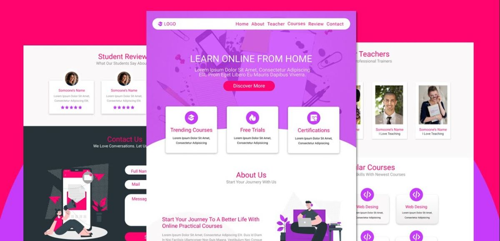

# 🎓 Online Education Website

## 🚀 Live Preview

Experience the future of online learning: [View Live Demo](https://alirafatartist.github.io/100DaysOfCode/implementions/Online%20Education%20Website)

## 🌟 Features

- 📚 Comprehensive course catalog
- 👨‍🏫 Expert instructors
- 📱 Responsive design for all devices
- 🎨 Modern and intuitive user interface

## 🛠️ Technologies Used

- HTML5
- CSS3
- JavaScript

## 🤝 Contributing

We welcome contributions! Please see our [Contributing Guidelines](CONTRIBUTING.md) for more details.

## 📄 License

This project is licensed under the MIT License - see the [LICENSE](LICENSE) file for details.

## 📞 Contact

For any questions or feedback, please reach out to [your-email@example.com](mailto:your-email@example.com).

---

⭐️ If you find this project useful, please consider giving it a star!
